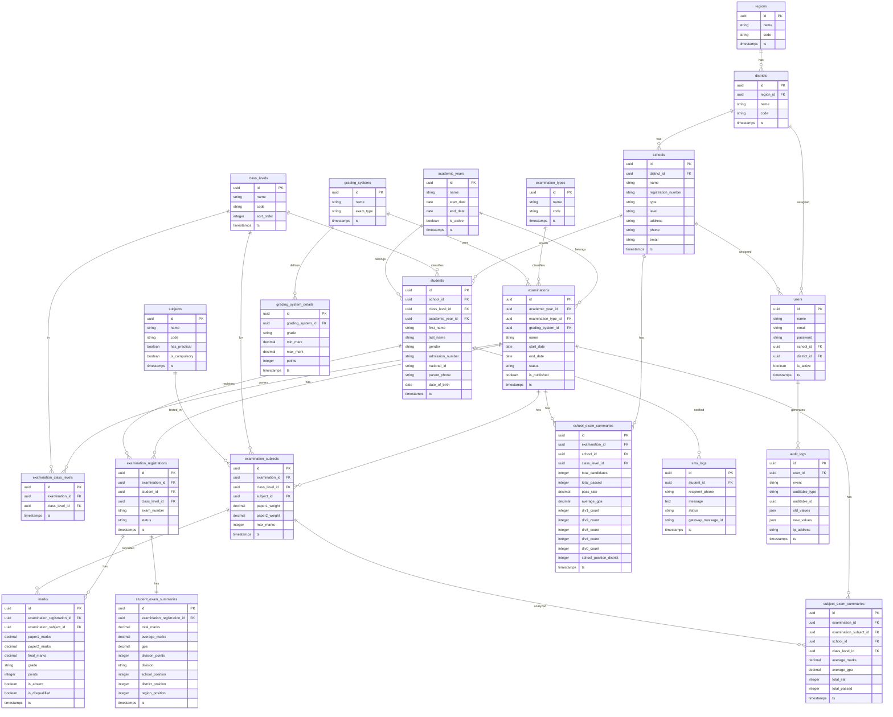
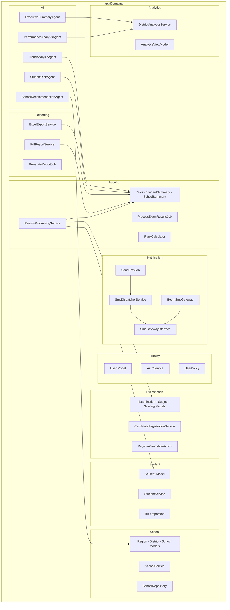
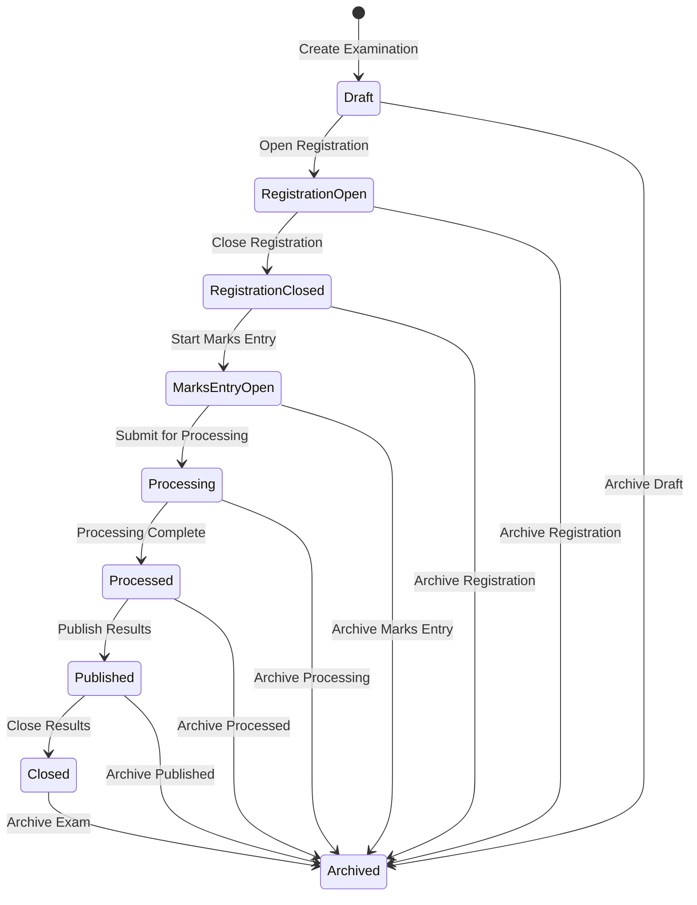
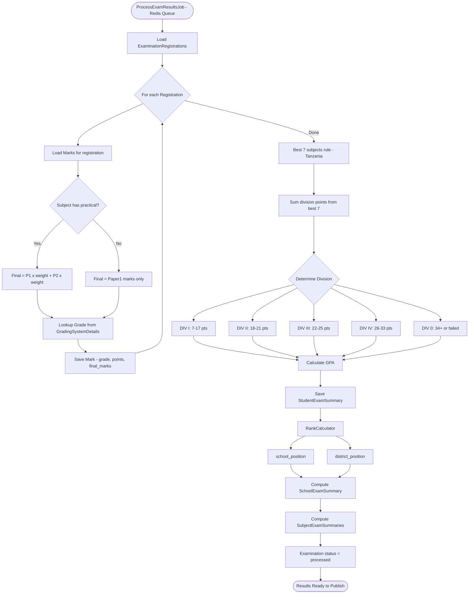
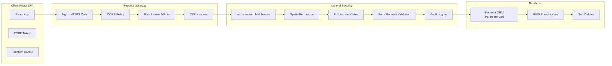
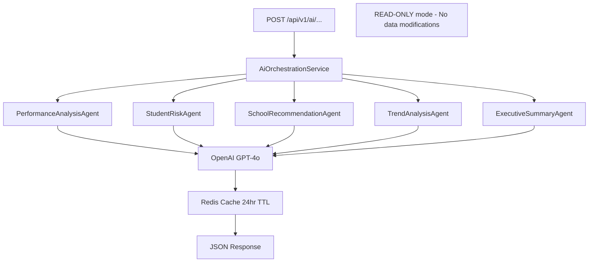
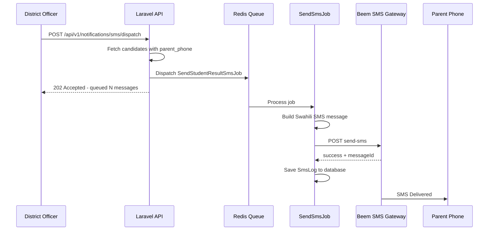
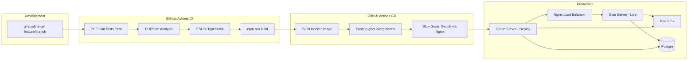
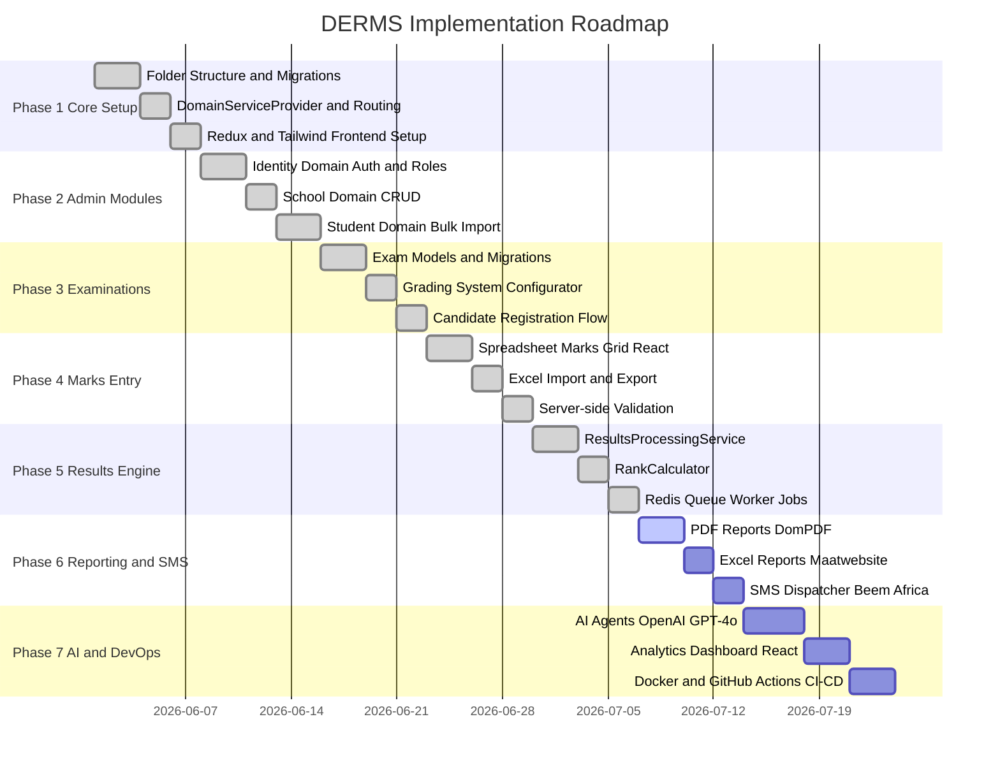

# DERMS - District Examination & Results Management System
## Complete Architecture & Design Diagrams

> **Version:** 1.0 | **Stack:** Laravel 13 + React 19 + PostgreSQL 17 | **Pattern:** Modular Monolith + REST API + SPA

---

## 1. HIGH-LEVEL SYSTEM ARCHITECTURE

```
+------------------------------------------------------------------+
|                        USER INTERFACES                           |
|                                                                  |
|  +-----------+  +-----------+  +-----------+  +-----------+     |
|  |Super Admin|  |District   |  |School     |  |Teacher /  |     |
|  |Dashboard  |  |Officer    |  |Admin      |  |Data Entry |     |
|  +-----------+  +-----------+  +-----------+  +-----------+     |
+------------------------------+-----------------------------------+
                               |
                     React 19 SPA (Vite)
               Redux Toolkit + RTK Query + React Router
               Tailwind v4 + ShadCN UI + TanStack Table
                               |
                          HTTPS / JSON
                               |
+------------------------------+-----------------------------------+
|                  LARAVEL 13 MODULAR MONOLITH                     |
|  +----------+ +----------+ +----------+ +------------------+    |
|  | Sanctum  | | Spatie   | | Policies | | Rate Limiting    |    |
|  | Auth     | | Permission| | & Gates  | | & Throttle       |    |
|  +----------+ +----------+ +----------+ +------------------+    |
|                                                                  |
|  +-----------------------------------------------------------+  |
|  |              DOMAIN MODULES (app/Domains/)                 |  |
|  |  Identity | School | Student | Examination | Results       |  |
|  |  Reporting | Analytics | Notification | AI                 |  |
|  +-----------------------------------------------------------+  |
|  +-------------+  +----------------------+  +----------------+  |
|  | Redis Cache |  |   Queue Workers       |  | Background Jobs|  |
|  | Sessions    |  | Results Processing    |  | ProcessExamJob |  |
|  | Rate Limit  |  | SMS Dispatch          |  | SendSmsJob     |  |
|  +-------------+  | Report Generation     |  | GeneratePdfJob |  |
|                   +----------------------+   +----------------+  |
+------------------------------+-----------------------------------+
                               |
           +-------------------+-------------------+
           |                   |                   |
   +-------+------+   +--------+-------+   +-------+--------+
   | PostgreSQL 17  |   | Redis 7.x       |   | File Storage   |
   | (Current)      |   | Cache + Queues  |   | PDFs + Exports |
   | Production DB  |   +-----------------+   +----------------+
   +--------------+
```

---

## 2. COMPLETE DATABASE SCHEMA (ERD)



---

## 3. DOMAIN MODULE ARCHITECTURE



---

## 4. EXAMINATION LIFECYCLE STATE MACHINE



---

## 5. RESULTS PROCESSING ENGINE FLOW



---

## 6. REST API ENDPOINTS

```
POST   /api/v1/auth/login
POST   /api/v1/auth/logout
GET    /api/v1/auth/user

GET    /api/v1/regions
POST   /api/v1/regions
GET    /api/v1/districts
POST   /api/v1/districts
GET    /api/v1/schools
POST   /api/v1/schools
GET    /api/v1/schools/{id}
PUT    /api/v1/schools/{id}
DELETE /api/v1/schools/{id}

GET    /api/v1/students
POST   /api/v1/students
GET    /api/v1/students/{id}
PUT    /api/v1/students/{id}
DELETE /api/v1/students/{id}
POST   /api/v1/students/bulk-import

GET    /api/v1/examinations
POST   /api/v1/examinations
GET    /api/v1/examinations/{id}
PUT    /api/v1/examinations/{id}
GET    /api/v1/examinations/{id}/subjects
POST   /api/v1/examinations/{id}/subjects
POST   /api/v1/examinations/{id}/open-registration
POST   /api/v1/examinations/{id}/close-registration

GET    /api/v1/examinations/{id}/registrations
POST   /api/v1/examinations/{id}/registrations
DELETE /api/v1/examinations/{id}/registrations/{regId}

GET    /api/v1/marks
POST   /api/v1/marks/bulk-save
POST   /api/v1/marks/import-excel
GET    /api/v1/marks/export-template

POST   /api/v1/examinations/{id}/process
POST   /api/v1/examinations/{id}/publish
POST   /api/v1/examinations/{id}/unpublish
GET    /api/v1/examinations/{id}/processing-status

GET    /api/v1/reports/{examId}/merit-list
GET    /api/v1/reports/{examId}/merit-list/pdf
GET    /api/v1/reports/{examId}/merit-list/excel
GET    /api/v1/reports/{examId}/student-slip/{regId}
GET    /api/v1/reports/{examId}/student-slip/{regId}/pdf
GET    /api/v1/reports/{examId}/school-summary/{schoolId}/{classLevelId}
GET    /api/v1/reports/{examId}/school-summary/{schoolId}/{classLevelId}/pdf
GET    /api/v1/reports/{examId}/district-summary/{classLevelId}
GET    /api/v1/reports/{examId}/district-summary/{classLevelId}/pdf

GET    /api/v1/analytics/{examId}/overview
GET    /api/v1/analytics/{examId}/subject-performance
POST   /api/v1/ai/performance-analysis
POST   /api/v1/ai/student-risk
POST   /api/v1/ai/school-recommendations
POST   /api/v1/ai/trend-analysis
POST   /api/v1/ai/executive-summary

POST   /api/v1/notifications/sms/dispatch
GET    /api/v1/notifications/sms/logs
```

---

## 7. SECURITY ARCHITECTURE



---

## 8. AI AGENTS ARCHITECTURE



---

## 9. SMS NOTIFICATION SEQUENCE



---

## 10. DEVOPS AND CI/CD PIPELINE



---

## 11. IMPLEMENTATION ROADMAP



---

## 12. USER ROLES AND PERMISSIONS

| Permission              | Super Admin | District Officer | School Admin | Teacher |
|-------------------------|-------------|------------------|--------------|---------|
| Manage Users            | YES         | NO               | NO           | NO      |
| Manage Schools          | YES         | YES              | NO           | NO      |
| Create Examination      | YES         | YES              | NO           | NO      |
| Register Candidates     | YES         | YES              | YES          | NO      |
| Enter Marks             | YES         | YES              | YES          | YES     |
| Process Results         | YES         | YES              | NO           | NO      |
| Publish Results         | YES         | YES              | NO           | NO      |
| View Merit List         | YES         | YES              | YES          | YES     |
| Download PDF Reports    | YES         | YES              | YES          | YES     |
| Send SMS Notifications  | YES         | YES              | NO           | NO      |
| View AI Insights        | YES         | YES              | YES          | NO      |
| System Settings         | YES         | NO               | NO           | NO      |
| View Audit Logs         | YES         | YES              | NO           | NO      |

---

## 13. KEY ARCHITECTURAL DECISIONS

| Decision                | Choice                    | Reason                                        |
|-------------------------|---------------------------|-----------------------------------------------|
| Architecture Pattern    | Modular Monolith          | Balance between simplicity and modularity     |
| Database Development    | PostgreSQL 17             | Matches current workspace and local stack     |
| Database Production     | PostgreSQL 17             | Same engine for dev and production            |
| Authentication          | Laravel Sanctum           | SPA and API token support                     |
| Authorization           | Spatie Permission         | Role and Permission granularity               |
| Queue Driver            | Redis                     | Reliable fast supports batching               |
| PDF Generation          | barryvdh/laravel-dompdf   | Laravel native uses Blade templates           |
| Excel Export            | maatwebsite/excel         | Laravel native supports streaming             |
| SMS Gateway             | Beem Africa               | Tanzania-local SMS provider                   |
| AI Provider             | OpenAI GPT-4o             | Best reasoning for education analytics        |
| Primary Keys            | UUID                      | Security no sequential ID enumeration         |
| Soft Deletes            | All tables                | Audit compliance and data recovery            |
| Frontend State          | Redux Toolkit + RTK Query | Predictable state DevTools built-in caching   |
| UI Components           | ShadCN UI + Tailwind v4   | Accessible customizable modern look           |
| Data Tables             | TanStack Table            | Virtual scrolling for 100k row datasets       |

---

*File: ARCHITECTURE.md | Location: C:\xampp\htdocs\DERMS\ARCHITECTURE.md*
*Last Updated: June 2026 | Status: Current*
