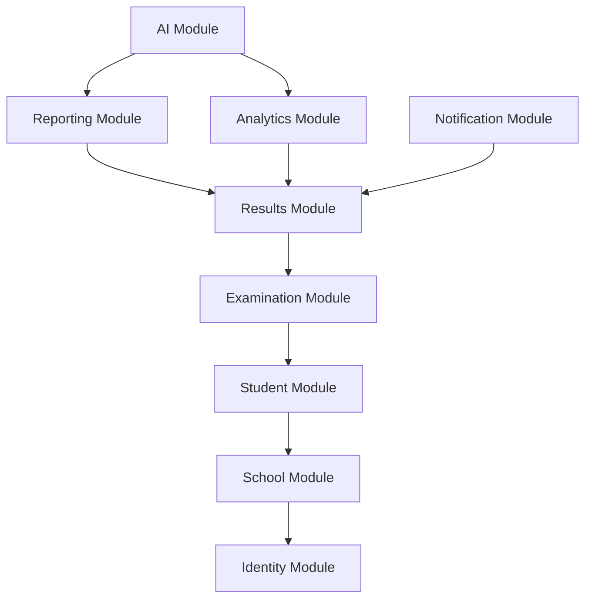
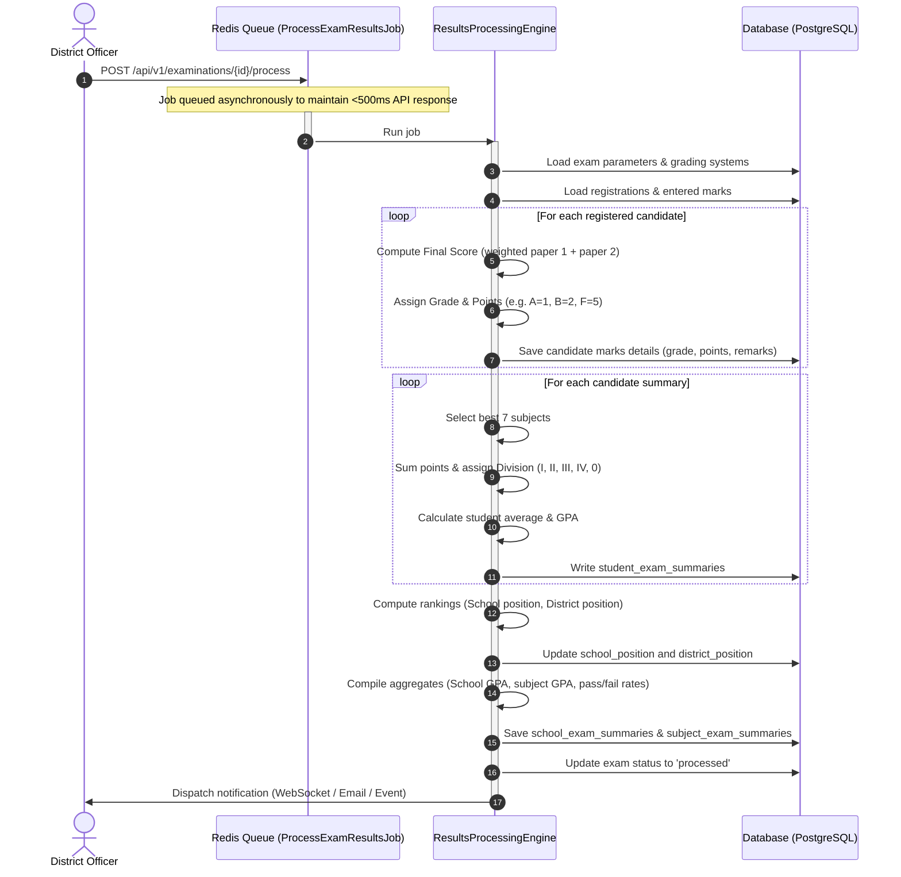
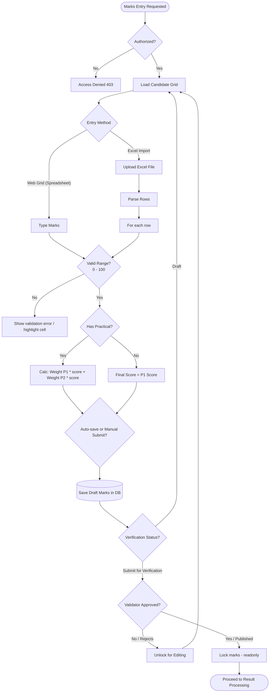
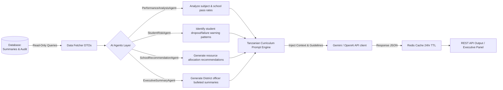
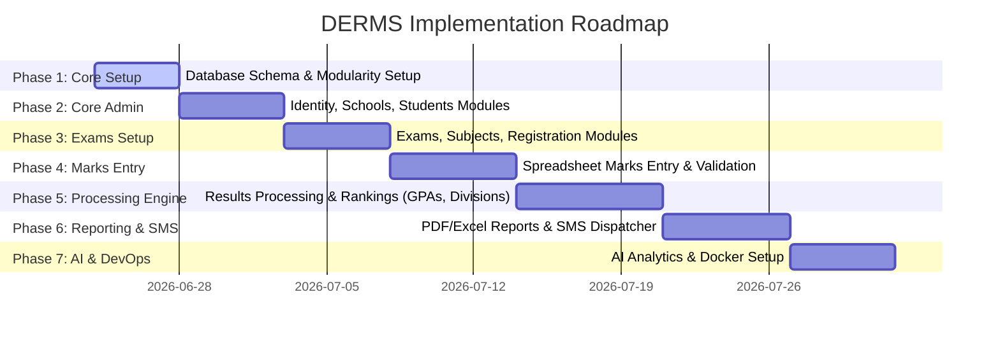

# Implementation Plan - District Examination & Results Management System (DERMS)

This implementation plan details the architecture, design, and incremental delivery strategy for the **District Examination & Results Management System (DERMS)**. 

---

## 1. System Architecture & High-Level Design

DERMS is structured as a **Modular Monolith** in Laravel 13 (Backend) serving a **React 19 SPA** (Frontend). 

```
                               +-----------------------------+
                               |         Web Browser         |
                               | (React 19 SPA + React Router|
                               |   RTK Query, Tailwind v4)   |
                               +--------------+--------------+
                                              |
                                     JSON REST API (HTTPS)
                                              |
                                              v
                               +--------------+--------------+
                               |     Laravel 13 Monolith     |
                               |    (Modular Monolith app)   |
                               +-------+--------------+------+
                                       |              |
                                  SQL Queries    Redis Cache
                                       |          & Queues
                                       v              v
                               +-------+------+  +----+------+
                               | PostgreSQL   |  |   Redis   |
                               | (Primary DB) |  |           |
                               +--------------+  +-----------+
```

### Architectural Decisions
1. **Database Standardization**: The system uses **PostgreSQL (v17)** as the primary database now. Eloquent ORM abstraction and standard SQL types will be used so future database changes, if any, remain manageable.
2. **REST API + SPA Router**: Laravel will serve a single entrypoint Blade view (`index.blade.php`) for all web requests (`/{any}`). The React frontend will run as an SPA using React Router, managing state with Redux Toolkit and calling the REST APIs via RTK Query. Laravel Sanctum will handle stateless cookie-based (session) or token-based authentication.
3. **Domain Modularity**: Code is structured under `app/Domains/`. Each domain is self-contained with its own Models, Actions, Services, Repositories, DTOs, Policies, Events, and Jobs. Shared helpers go in `app/Concerns/` or `app/Traits/`.

---

## 2. Directory Structure

The directory structure is organized to maintain modularity.

```
derms/
├── app/
│   ├── Concerns/               # Shared concerns/helper classes
│   ├── Domains/                # Domain-Driven Design Modules
│   │   ├── AI/                 # AI Agents, Prompts, Client integrations
│   │   ├── Analytics/          # Aggregates, Charts, Statistics logic
│   │   ├── Examination/        # Exams, Subjects, ClassLevels, Regs, Grading Systems
│   │   ├── Identity/           # Users, Roles, Permissions, Auth
│   │   ├── Notification/       # SMS Notification System, SMS Logs
│   │   ├── Reporting/          # PDF/Excel/CSV generation, Result Sheets
│   │   ├── Results/            # Marks, Processing, Verification, Summaries
│   │   ├── School/             # Regions, Districts, Schools
│   │   └── Student/            # Students, Academic Years
│   │       # Each domain contains:
│   │       ├── Actions/        # Single-responsibility logic executors
│   │       ├── DTOs/           # Data Transfer Objects
│   │       ├── Events/         # Domain events
│   │       ├── Jobs/           # Queueable background jobs
│   │       ├── Models/         # Domain Eloquent models
│   │       ├── Policies/       # Authorization policies
│   │       ├── Repositories/   # Database access layer
│   │       └── Services/       # Business logic engines
│   ├── Http/
│   │   ├── Controllers/
│   │   │   └── Api/            # API Controllers routing to Domain Actions
│   │   ├── Middleware/         # Custom Middlewares (e.g., Audit logs, Roles)
│   │   ├── Requests/           # Global validation requests
│   │   └── Resources/          # API JSON transformers
│   └── Providers/              # Custom providers registering Domain routes & bindings
├── database/
│   ├── factories/              # Database factories mapping to Domain models
│   ├── migrations/             # Database migrations
│   └── seeders/                # Database seeders
├── resources/
│   ├── js/                     # React 19 Frontend
│   │   ├── app/                # Global config, RTK Store
│   │   ├── api/                # RTK Query API slices
│   │   ├── components/         # Reusable UI components (Shadcn, Tables, Inputs)
│   │   ├── features/           # Feature modules (auth, dashboard, exams, marks)
│   │   ├── hooks/              # Custom React hooks
│   │   ├── layouts/            # Page layouts (DashboardLayout, AuthLayout)
│   │   ├── pages/              # SPA Pages
│   │   ├── routes/             # Client-side router configs
│   │   ├── services/           # External API client services
│   │   ├── types/              # TypeScript typings
│   │   └── utils/              # Client utility functions
│   └── views/
│       └── app.blade.php       # Single Blade entrypoint for React SPA
```

---

## 3. Database Schema

All tables use **UUID Primary Keys** (using `HasUuids` in Laravel), support soft deletes (`deleted_at`), and contain standard audit/audit-adjacent fields. High-impact indexes are declared explicitly.

```sql
-- 1. REGIONS
CREATE TABLE regions (
    id UUID PRIMARY KEY,
    name VARCHAR(100) UNIQUE NOT NULL,
    code VARCHAR(10) UNIQUE NOT NULL,
    created_at TIMESTAMP,
    updated_at TIMESTAMP,
    deleted_at TIMESTAMP
);
CREATE INDEX idx_regions_deleted ON regions(deleted_at);

-- 2. DISTRICTS
CREATE TABLE districts (
    id UUID PRIMARY KEY,
    region_id UUID NOT NULL REFERENCES regions(id) ON DELETE CASCADE,
    name VARCHAR(100) NOT NULL,
    code VARCHAR(10) UNIQUE NOT NULL,
    created_at TIMESTAMP,
    updated_at TIMESTAMP,
    deleted_at TIMESTAMP,
    UNIQUE(region_id, name)
);
CREATE INDEX idx_districts_region ON districts(region_id);
CREATE INDEX idx_districts_deleted ON districts(deleted_at);

-- 3. SCHOOLS
CREATE TABLE schools (
    id UUID PRIMARY KEY,
    district_id UUID NOT NULL REFERENCES districts(id) ON DELETE CASCADE,
    name VARCHAR(150) NOT NULL,
    registration_number VARCHAR(50) UNIQUE NOT NULL,
    type VARCHAR(20) NOT NULL, -- 'government', 'private'
    level VARCHAR(20) NOT NULL, -- 'primary', 'secondary'
    phone_number VARCHAR(20),
    email VARCHAR(100),
    address TEXT,
    created_at TIMESTAMP,
    updated_at TIMESTAMP,
    deleted_at TIMESTAMP
);
CREATE INDEX idx_schools_district ON schools(district_id);
CREATE INDEX idx_schools_reg_num ON schools(registration_number);
CREATE INDEX idx_schools_deleted ON schools(deleted_at);

-- 4. USERS
CREATE TABLE users (
    id UUID PRIMARY KEY,
    school_id UUID REFERENCES schools(id) ON DELETE SET NULL, -- Nullable for District Officers / Admins
    district_id UUID REFERENCES districts(id) ON DELETE SET NULL, -- Nullable for School Admins / Teachers
    name VARCHAR(255) NOT NULL,
    email VARCHAR(255) UNIQUE NOT NULL,
    phone_number VARCHAR(20),
    password VARCHAR(255) NOT NULL,
    status VARCHAR(20) NOT NULL DEFAULT 'active', -- 'active', 'inactive', 'suspended'
    remember_token VARCHAR(100),
    created_at TIMESTAMP,
    updated_at TIMESTAMP,
    deleted_at TIMESTAMP
);
CREATE INDEX idx_users_school ON users(school_id);
CREATE INDEX idx_users_district ON users(district_id);
CREATE INDEX idx_users_email ON users(email);
CREATE INDEX idx_users_deleted ON users(deleted_at);

-- 5. ACADEMIC YEARS
CREATE TABLE academic_years (
    id UUID PRIMARY KEY,
    name VARCHAR(4) UNIQUE NOT NULL, -- e.g., '2026'
    start_date DATE NOT NULL,
    end_date DATE NOT NULL,
    is_active BOOLEAN NOT NULL DEFAULT false,
    created_at TIMESTAMP,
    updated_at TIMESTAMP,
    deleted_at TIMESTAMP
);
CREATE INDEX idx_academic_years_active ON academic_years(is_active);

-- 6. CLASS LEVELS
CREATE TABLE class_levels (
    id UUID PRIMARY KEY,
    name VARCHAR(50) UNIQUE NOT NULL, -- e.g., 'Form One', 'Form Two', 'Form Three', 'Form Four'
    numeric_level INT UNIQUE NOT NULL, -- 1, 2, 3, 4 for sorting and progression
    created_at TIMESTAMP,
    updated_at TIMESTAMP,
    deleted_at TIMESTAMP
);

-- 7. STUDENTS
CREATE TABLE students (
    id UUID PRIMARY KEY,
    school_id UUID NOT NULL REFERENCES schools(id) ON DELETE CASCADE,
    academic_year_id UUID NOT NULL REFERENCES academic_years(id),
    current_class_level_id UUID NOT NULL REFERENCES class_levels(id),
    registration_number VARCHAR(50) UNIQUE NOT NULL, -- Unique Student Registration No
    first_name VARCHAR(100) NOT NULL,
    middle_name VARCHAR(100),
    last_name VARCHAR(100) NOT NULL,
    gender CHAR(1) NOT NULL, -- 'M', 'F'
    date_of_birth DATE,
    parent_name VARCHAR(150),
    parent_phone VARCHAR(20) NOT NULL, -- SMS notifications
    status VARCHAR(20) NOT NULL DEFAULT 'active', -- 'active', 'transferred', 'completed'
    created_at TIMESTAMP,
    updated_at TIMESTAMP,
    deleted_at TIMESTAMP
);
CREATE INDEX idx_students_school ON students(school_id);
CREATE INDEX idx_students_class ON students(current_class_level_id);
CREATE INDEX idx_students_deleted ON students(deleted_at);

-- 8. SUBJECTS
CREATE TABLE subjects (
    id UUID PRIMARY KEY,
    name VARCHAR(100) UNIQUE NOT NULL,
    code VARCHAR(10) UNIQUE NOT NULL, -- e.g., '011', '033'
    has_practical BOOLEAN NOT NULL DEFAULT false,
    created_at TIMESTAMP,
    updated_at TIMESTAMP,
    deleted_at TIMESTAMP
);

-- 9. GRADING SYSTEMS
CREATE TABLE grading_systems (
    id UUID PRIMARY KEY,
    name VARCHAR(100) NOT NULL, -- e.g. 'NECTA Form Four Subject Grading', 'NECTA Form Four Division'
    class_level_id UUID REFERENCES class_levels(id) ON DELETE CASCADE,
    type VARCHAR(20) NOT NULL, -- 'subject', 'division'
    created_at TIMESTAMP,
    updated_at TIMESTAMP,
    deleted_at TIMESTAMP
);

-- 10. GRADING SYSTEM DETAILS
CREATE TABLE grading_system_details (
    id UUID PRIMARY KEY,
    grading_system_id UUID NOT NULL REFERENCES grading_systems(id) ON DELETE CASCADE,
    grade VARCHAR(5) NOT NULL, -- 'A', 'B', 'C', 'D', 'F' or 'I', 'II', 'III', 'IV', '0'
    min_score DECIMAL(5,2) NOT NULL, -- e.g., 75.00
    max_score DECIMAL(5,2) NOT NULL, -- e.g., 100.00
    min_points INT, -- for division grading
    max_points INT, -- for division grading
    points INT NOT NULL, -- e.g., A=1, B=2, C=3, D=4, F=5
    description VARCHAR(255),
    created_at TIMESTAMP,
    updated_at TIMESTAMP
);

-- 11. EXAMINATION TYPES
CREATE TABLE examination_types (
    id UUID PRIMARY KEY,
    name VARCHAR(100) UNIQUE NOT NULL, -- 'Mock', 'Series', 'Pre-Mock'
    code VARCHAR(20) UNIQUE NOT NULL,
    description TEXT,
    created_at TIMESTAMP,
    updated_at TIMESTAMP,
    deleted_at TIMESTAMP
);

-- 12. EXAMINATIONS
CREATE TABLE examinations (
    id UUID PRIMARY KEY,
    academic_year_id UUID NOT NULL REFERENCES academic_years(id),
    examination_type_id UUID NOT NULL REFERENCES examination_types(id),
    name VARCHAR(150) NOT NULL,
    start_date DATE NOT NULL,
    end_date DATE NOT NULL,
    status VARCHAR(20) NOT NULL DEFAULT 'draft', -- 'draft', 'registration', 'marks_entry', 'processing', 'published'
    created_by UUID NOT NULL REFERENCES users(id),
    created_at TIMESTAMP,
    updated_at TIMESTAMP,
    deleted_at TIMESTAMP
);
CREATE INDEX idx_exams_academic_year ON examinations(academic_year_id);
CREATE INDEX idx_exams_status ON examinations(status);
CREATE INDEX idx_exams_deleted ON examinations(deleted_at);

-- 13. EXAMINATION CLASS LEVELS (m:n)
CREATE TABLE examination_class_levels (
    id UUID PRIMARY KEY,
    examination_id UUID NOT NULL REFERENCES examinations(id) ON DELETE CASCADE,
    class_level_id UUID NOT NULL REFERENCES class_levels(id) ON DELETE CASCADE,
    created_at TIMESTAMP,
    updated_at TIMESTAMP
);
CREATE UNIQUE INDEX idx_exam_class_level ON examination_class_levels(examination_id, class_level_id);

-- 14. EXAMINATION SUBJECTS
CREATE TABLE examination_subjects (
    id UUID PRIMARY KEY,
    examination_id UUID NOT NULL REFERENCES examinations(id) ON DELETE CASCADE,
    class_level_id UUID NOT NULL REFERENCES class_levels(id) ON DELETE CASCADE,
    subject_id UUID NOT NULL REFERENCES subjects(id) ON DELETE CASCADE,
    max_marks DECIMAL(5,2) NOT NULL DEFAULT 100.00,
    pass_marks DECIMAL(5,2) NOT NULL DEFAULT 30.00,
    paper_one_weight DECIMAL(5,2) DEFAULT 100.00, -- Theory (out of 100% or weighted)
    paper_two_weight DECIMAL(5,2) DEFAULT 0.00,   -- Practical
    created_at TIMESTAMP,
    updated_at TIMESTAMP
);
CREATE UNIQUE INDEX idx_exam_class_subject ON examination_subjects(examination_id, class_level_id, subject_id);

-- 15. EXAMINATION REGISTRATIONS
CREATE TABLE examination_registrations (
    id UUID PRIMARY KEY,
    examination_id UUID NOT NULL REFERENCES examinations(id) ON DELETE CASCADE,
    student_id UUID NOT NULL REFERENCES students(id) ON DELETE CASCADE,
    class_level_id UUID NOT NULL REFERENCES class_levels(id) ON DELETE CASCADE,
    exam_number VARCHAR(50) UNIQUE NOT NULL, -- Candidate Number e.g. S0101/0001/2026
    status VARCHAR(20) NOT NULL DEFAULT 'registered', -- 'registered', 'absent', 'disqualified'
    created_at TIMESTAMP,
    updated_at TIMESTAMP,
    deleted_at TIMESTAMP
);
CREATE INDEX idx_exam_regs_student ON examination_registrations(student_id);
CREATE INDEX idx_exam_regs_exam ON examination_registrations(examination_id);
CREATE INDEX idx_exam_regs_deleted ON examination_registrations(deleted_at);
CREATE UNIQUE INDEX idx_exam_student ON examination_registrations(examination_id, student_id);

-- 16. MARKS
CREATE TABLE marks (
    id UUID PRIMARY KEY,
    examination_registration_id UUID NOT NULL REFERENCES examination_registrations(id) ON DELETE CASCADE,
    examination_subject_id UUID NOT NULL REFERENCES examination_subjects(id) ON DELETE CASCADE,
    paper_one_score DECIMAL(5,2) DEFAULT NULL, -- Nullable (Paper 1 Theory)
    paper_two_score DECIMAL(5,2) DEFAULT NULL, -- Nullable (Paper 2 Practical)
    final_score DECIMAL(5,2) DEFAULT NULL,     -- Sum or weight-calculated final score
    grade VARCHAR(5),                          -- Derived (A, B, C, D, F)
    points INT,                                -- Derived (1 to 5)
    remarks VARCHAR(50),                       -- 'Pass', 'Fail', 'Absent'
    entered_by UUID REFERENCES users(id),
    is_validated BOOLEAN NOT NULL DEFAULT false,
    created_at TIMESTAMP,
    updated_at TIMESTAMP,
    deleted_at TIMESTAMP
);
CREATE UNIQUE INDEX idx_marks_registration_subject ON marks(examination_registration_id, examination_subject_id);
CREATE INDEX idx_marks_deleted ON marks(deleted_at);

-- 17. STUDENT EXAM SUMMARIES
CREATE TABLE student_exam_summaries (
    id UUID PRIMARY KEY,
    examination_registration_id UUID UNIQUE NOT NULL REFERENCES examination_registrations(id) ON DELETE CASCADE,
    total_marks DECIMAL(7,2) NOT NULL DEFAULT 0.00,
    average_marks DECIMAL(5,2) NOT NULL DEFAULT 0.00,
    gpa DECIMAL(4,2) NOT NULL DEFAULT 0.00, -- Student GPA based on points
    division VARCHAR(5),                   -- 'I', 'II', 'III', 'IV', '0'
    division_points INT,                   -- Sum of points of best 7 subjects
    passed_subjects_count INT NOT NULL DEFAULT 0,
    failed_subjects_count INT NOT NULL DEFAULT 0,
    school_position INT,
    district_position INT,
    status VARCHAR(20) NOT NULL DEFAULT 'processed',
    created_at TIMESTAMP,
    updated_at TIMESTAMP
);

-- 18. SCHOOL EXAM SUMMARIES
CREATE TABLE school_exam_summaries (
    id UUID PRIMARY KEY,
    examination_id UUID NOT NULL REFERENCES examinations(id) ON DELETE CASCADE,
    school_id UUID NOT NULL REFERENCES schools(id) ON DELETE CASCADE,
    class_level_id UUID NOT NULL REFERENCES class_levels(id) ON DELETE CASCADE,
    registered_candidates INT NOT NULL DEFAULT 0,
    sat_candidates INT NOT NULL DEFAULT 0,
    absent_candidates INT NOT NULL DEFAULT 0,
    total_gpa DECIMAL(4,2) NOT NULL DEFAULT 0.00, -- School aggregate GPA (lower is better in NECTA)
    division_i_count INT NOT NULL DEFAULT 0,
    division_ii_count INT NOT NULL DEFAULT 0,
    division_iii_count INT NOT NULL DEFAULT 0,
    division_iv_count INT NOT NULL DEFAULT 0,
    division_zero_count INT NOT NULL DEFAULT 0,
    pass_rate DECIMAL(5,2) NOT NULL DEFAULT 0.00, -- (Sat - Div 0)/Sat * 100
    fail_rate DECIMAL(5,2) NOT NULL DEFAULT 0.00,
    school_position_district INT,
    created_at TIMESTAMP,
    updated_at TIMESTAMP
);
CREATE UNIQUE INDEX idx_school_exam_class ON school_exam_summaries(examination_id, school_id, class_level_id);

-- 19. SUBJECT EXAM SUMMARIES
CREATE TABLE subject_exam_summaries (
    id UUID PRIMARY KEY,
    examination_id UUID NOT NULL REFERENCES examinations(id) ON DELETE CASCADE,
    class_level_id UUID NOT NULL REFERENCES class_levels(id) ON DELETE CASCADE,
    subject_id UUID NOT NULL REFERENCES subjects(id) ON DELETE CASCADE,
    school_id UUID REFERENCES schools(id) ON DELETE CASCADE, -- Nullable (represents district-wide aggregate if NULL)
    registered_candidates INT NOT NULL DEFAULT 0,
    sat_candidates INT NOT NULL DEFAULT 0,
    total_score DECIMAL(10,2) NOT NULL DEFAULT 0.00,
    average_score DECIMAL(5,2) NOT NULL DEFAULT 0.00,
    gpa DECIMAL(4,2) NOT NULL DEFAULT 0.00, -- Subject GPA (lower is better, average of candidate points)
    grade_a_count INT NOT NULL DEFAULT 0,
    grade_b_count INT NOT NULL DEFAULT 0,
    grade_c_count INT NOT NULL DEFAULT 0,
    grade_d_count INT NOT NULL DEFAULT 0,
    grade_f_count INT NOT NULL DEFAULT 0,
    subject_position_district INT, -- position of school in this subject within the district
    created_at TIMESTAMP,
    updated_at TIMESTAMP
);
CREATE INDEX idx_subj_exam_agg ON subject_exam_summaries(examination_id, class_level_id, subject_id, school_id);

-- 20. SMS LOGS
CREATE TABLE sms_logs (
    id UUID PRIMARY KEY,
    student_id UUID NOT NULL REFERENCES students(id) ON DELETE CASCADE,
    examination_registration_id UUID NOT NULL REFERENCES examination_registrations(id) ON DELETE CASCADE,
    phone_number VARCHAR(20) NOT NULL,
    message TEXT NOT NULL,
    status VARCHAR(20) NOT NULL DEFAULT 'pending', -- 'pending', 'sent', 'failed'
    error_message TEXT,
    sent_at TIMESTAMP,
    created_at TIMESTAMP,
    updated_at TIMESTAMP
);
CREATE INDEX idx_sms_logs_status ON sms_logs(status);

-- 21. AUDIT LOGS
CREATE TABLE audit_logs (
    id UUID PRIMARY KEY,
    user_id UUID REFERENCES users(id) ON DELETE SET NULL,
    action VARCHAR(100) NOT NULL,
    description TEXT NOT NULL,
    ip_address VARCHAR(45),
    user_agent VARCHAR(255),
    old_values JSONB,
    new_values JSONB,
    created_at TIMESTAMP
);
CREATE INDEX idx_audit_logs_user ON audit_logs(user_id);
CREATE INDEX idx_audit_logs_action ON audit_logs(action);

-- 22. SYSTEM SETTINGS
CREATE TABLE system_settings (
    id UUID PRIMARY KEY,
    key VARCHAR(100) UNIQUE NOT NULL,
    value TEXT,
    description VARCHAR(255),
    created_at TIMESTAMP,
    updated_at TIMESTAMP
);
```

---

## 4. Entity Relationship Diagram (ERD)

This diagram shows the primary relationships between core entities.

```mermaid
erDiagram
    REGIONS ||--o{ DISTRICTS : contains
    DISTRICTS ||--o{ SCHOOLS : contains
    SCHOOLS ||--o{ USERS : employs
    DISTRICTS ||--o{ USERS : employs
    SCHOOLS ||--o{ STUDENTS : registers
    ACADEMIC-YEARS ||--o{ STUDENTS : has
    CLASS-LEVELS ||--o{ STUDENTS : has
    
    ACADEMIC-YEARS ||--o{ EXAMINATIONS : runs
    EXAMINATION-TYPES ||--o{ EXAMINATIONS : defines
    EXAMINATIONS ||--|{ EXAMINATION-CLASS-LEVELS : involves
    CLASS-LEVELS ||--|{ EXAMINATION-CLASS-LEVELS : belongs-to
    
    EXAMINATIONS ||--|{ EXAMINATION-SUBJECTS : includes
    CLASS-LEVELS ||--|{ EXAMINATION-SUBJECTS : is-evaluated-on
    SUBJECTS ||--|{ EXAMINATION-SUBJECTS : mapped-to
    
    EXAMINATIONS ||--o{ EXAMINATION-REGISTRATIONS : registers
    STUDENTS ||--o{ EXAMINATION-REGISTRATIONS : is-candidate-for
    
    EXAMINATION-REGISTRATIONS ||--o{ MARKS : scores
    EXAMINATION-SUBJECTS ||--o{ MARKS : records-for
    
    EXAMINATION-REGISTRATIONS ||--|| STUDENT-EXAM-SUMMARIES : precomputes
    EXAMINATIONS ||--o{ SCHOOL-EXAM-SUMMARIES : aggregates
    SCHOOLS ||--o{ SCHOOL-EXAM-SUMMARIES : ranked-in
    
    EXAMINATIONS ||--o{ SUBJECT-EXAM-SUMMARIES : aggregates-subject-performance
    SUBJECTS ||--o{ SUBJECT-EXAM-SUMMARIES : aggregates-for
    SCHOOLS ||--o{ SUBJECT-EXAM-SUMMARIES : aggregates-at
```

---

## 5. Domain Model (DDD Abstractions)

The domain modular monolith isolates features into independent directories. Communication across domains will use interfaces, data transfer objects (DTOs), and asynchronous events.

```
       +-----------------------+
       |   Controller (API)    |
       +-----------+-----------+
                   | (Passes DTO)
                   v
       +-----------------------+
       |     Domain Action     | <------+ (Authorizes using Domain Policy)
       +-----------+-----------+
                   |
         +---------+---------+
         |                   |
         v                   v
+-----------------+ +-----------------+
| Domain Service  | |   Repository    |
| (Business logic)| |(Database queries|
+--------+--------+ +--------+--------+
         |                   |
         +---------+---------+
                   |
                   v
       +-----------------------+
       |     Domain Model      |
       +-----------------------+
```

### Domain Interfaces (Contracts)
Domains publish their available capability interfaces under a `Contracts/` folder or namespace.
- E.g., `app/Domains/Results/Services/ResultProcessingEngineInterface.php` defines standard routines for computing marks, grades, points, and ranks.
- E.g., `app/Domains/Notification/Services/SmsGatewayInterface.php` defines the SMS dispatch contracts.

---

## 6. API Design (Endpoints)

All endpoints return JSON and are prefixed with `/api/v1`. Authenticated routes require Bearer tokens or Sanctum cookie sessions.

### Authentication & Profiles
- `POST /api/v1/auth/login` - Authenticate users, issues Sanctum tokens/session
- `POST /api/v1/auth/logout` - Revoke current token
- `GET /api/v1/auth/me` - Fetch authenticated user details with roles & permissions

### School Management
- `GET /api/v1/schools` - List schools (Filter by District, Level, Type)
- `POST /api/v1/schools` - Register new school (District Officer / Super Admin only)
- `GET /api/v1/schools/{id}` - Fetch single school details
- `PUT /api/v1/schools/{id}` - Update school information

### Academic Calendar & Configuration
- `GET /api/v1/academic-years` - List academic years
- `POST /api/v1/academic-years` - Create academic year (Super Admin only)
- `GET /api/v1/class-levels` - Get class levels
- `GET /api/v1/subjects` - List and filter curriculum subjects

### Student Registration
- `GET /api/v1/students` - Query students with server-side pagination and filters
- `POST /api/v1/students` - Add single student
- `POST /api/v1/students/bulk` - Bulk upload students via Excel template
- `PUT /api/v1/students/{id}` - Update student record

### Examination Configuration
- `GET /api/v1/examinations` - List examinations (with status, academic year filters)
- `POST /api/v1/examinations` - Create new examination
- `POST /api/v1/examinations/{id}/register` - Bulk-register schools/candidates for exam
- `GET /api/v1/examinations/{id}/candidates` - List registered candidates
- `PUT /api/v1/examinations/{id}/status` - Advance exam phase (e.g. `draft` -> `registration` -> `marks_entry` -> `processing` -> `published`)

### Marks Entry & Processing
- `GET /api/v1/marks/exams/{examId}/class-levels/{classLevelId}/subjects/{subjectId}` - Fetch spreadsheet marks entry grid for a class/subject (returns candidate names, registration numbers, paper_one_score, paper_two_score, and final_score)
- `POST /api/v1/marks/bulk-save` - Bulk save marks entry rows (Supports Excel style paste / autosave)
- `POST /api/v1/marks/import-excel` - Import marks sheet file
- `POST /api/v1/examinations/{id}/process` - Queue processing background job (Calculates division, average, GPA, student ranking, school ranking)

### Reports & PDF/Excel Export
- `GET /api/v1/reports/exams/{examId}/results-sheet` - Download overall candidates results sheet (PDF/Excel)
- `GET /api/v1/reports/exams/{examId}/student/{candidateId}` - Individual student results slip (PDF)
- `GET /api/v1/reports/exams/{examId}/school-summary` - Performance summary per school (GPA, divisions, rankings)
- `GET /api/v1/reports/exams/{examId}/subject-analysis` - Performance aggregates per subject across school/district

### Notifications
- `POST /api/v1/examinations/{examId}/notifications/sms` - Send results to parent phone numbers via SMS queue

### AI Services
- `GET /api/v1/ai/exams/{examId}/performance-report` - Generate executive summary of exam metrics
- `GET /api/v1/ai/exams/{examId}/at-risk-students` - Retrieve lists of students displaying high-risk failure patterns

---

## 7. Architectural Diagrams

### 7.1 Module Dependency Map

This map ensures strict decoupling. Circular dependencies are avoided.



### 7.2 Results Processing Pipeline (Core Engine)

The sequence diagram below displays the execution path of the results processing engine, run asynchronously to manage high-volume candidate computations.



### 7.3 Marks Entry & Validation Flow

This flowchart describes client-side cell validation and server-side data constraint checks.



### 7.4 AI Insights Agent Architecture

This diagram shows how AI agents run strictly in read-only mode using pre-computed database summaries.



---

## 8. Implementation Roadmap (Iterative Milestones)

To keep implementation organized and verifiable, development is structured into **seven incremental stages**.



### Phase 1: Core Architecture & Modularity Setup
- Define directory structure (`app/Domains/` modules setup).
- Run base database migrations (academic years, class levels, regions, districts, schools, users).
- Establish custom routing provider registering sub-domain API endpoints.
- Configure Tailwind CSS v4, Redux Store, and client API layers.

### Phase 2: Identity, School, and Student Administration
- Setup Laravel Sanctum & Spatie Permission.
- Implement UI for User management, School enrollment, and Class level mapping.
- Implement student profile creation and bulk CSV/Excel student roster importing.
- *Verify:* Setup unit tests checking CRUD operations for schools/students.

### Phase 3: Examination Configuration & Candidate Registration
- Setup tables for `examinations`, `examination_class_levels`, `examination_subjects`, and `grading_systems`.
- Implement grading scheme rules configuration (A-F rules, Points, Division thresholds).
- Implement Candidate registration console (register students to examinations, generating exam candidate numbers).
- *Verify:* Automated registration test scripts.

### Phase 4: Spreadsheet-Style Marks Entry
- Build high-performance spreadsheet-style marks entry grid in React (keyboard navigation, autosave triggers, paper 1 & 2 weight calculation).
- Implement Excel template exporter & importer for marks entry.
- Implement server-side verification: marks boundaries checks, practical verification, absent/disqualified candidate handling.
- *Verify:* Validation boundary unit tests.

### Phase 5: Results Processing Engine & Rankings
- Develop the core processing job:
  - Aggregate scores per candidate (calculate final score based on theory and practical weight).
  - Assign subject grade and points (A=1 to F=5).
  - For candidate summary: select best 7 subjects, sum points, assign division (I to 0), compute GPA.
  - Compile school GPA, subject GPA, district rankings, and subject rank aggregates.
- Implement background queue workers using Redis.
- *Verify:* Run processing test script with 10,000 synthetic candidates to verify correctness of grades, GPA, and positions.

### Phase 6: Report Generation & SMS Dispatcher
- Design PDF output layouts using `barryvdh/laravel-dompdf` or similar (Results Sheets, Student Results Slip, District Rank list).
- Implement Excel sheets exporting using `maatwebsite/excel`.
- Integrate parent SMS notification queue triggered upon publishing exam results.
- *Verify:* Preview reports and verify SMS log tables.

### Phase 7: AI Insights Engine & Production Docker Deploy
- Implement AI Agent classes (`PerformanceAnalysisAgent`, `StudentRiskAgent`, etc.) mapping to an AI model interface.
- Add AI insight side-panels to dashboards summarizing top takeaways and high-risk student warnings.
- Build production-ready Docker containers (Web, Worker, Scheduler, Redis, PostgreSQL).
- Author GitHub Actions deployment files.

---

## 9. Open Questions & Design Decisions for User

> [!IMPORTANT]
> **1. NECTA Grading Systems Definition**
> Should we pre-seed the system with Tanzania NECTA standard grading rules (e.g., CSEE / Form Four: A=75-100, B=65-74, C=45-64, D=30-44, F=0-29; division points: Div I = 7-17, Div II = 18-21, Div III = 22-25, Div IV = 26-33, Div 0 = 34-35)? We plan to make this configurable in the database, but having pre-seeded defaults will save time. Please confirm.

> [!IMPORTANT]
> **2. SMS Gateway Provider**
> Which Tanzanian SMS gateway API will be used (e.g., Beem SMS, NextSMS, SMSAra)? We will write a driver-based interface so any SMS provider can be integrated, but knowing the preferred API will allow us to implement it out-of-the-box.

> [!NOTE]
> **3. Server Infrastructure**
> For the Docker container setup, do you want us to write standard Compose configurations, and is there a target server OS (e.g., Ubuntu LTS on VPS or XAMPP on Windows)? We see the codebase is in `c:\xampp\htdocs\DERMS` which is XAMPP on Windows. For local development, running `artisan serve` works, and we can configure Docker for staging/production.
 
# Implementation Plan: Modular Feature Dashboards for DERMS Console

To build all 70+ views requested by the user, we will implement a **Modular Tab-Based Routing Architecture**. Instead of creating 70 separate boilerplate files, we will consolidate them into **11 Premium Feature Dashboards** under `resources/js/pages/`. Each dashboard will parse the URL path (or a search query/sub-route) to render the corresponding view, forms, and charts.

---

## 1. Feature Dashboard Mapping

Each of the 11 main domains will have a unified dashboard page containing sub-views:

| Main Dashboard | Page Component | Sub-Views / Sidebar Routes Covered |
|---|---|---|
| **Identity & Admin** | `AdminDashboard.tsx` [NEW] | `/users`, `/roles`, `/permissions`, `/audit/user-activities`, `/audit-logs` |
| **Academic Setup** | `AcademicSetupPage.tsx` [NEW] | `/academic-years`, `/class-levels`, `/subjects`, `/subject-groups`, `/grading-systems`, `/division-rules` |
| **Settings** | `SystemSettingsPage.tsx` [NEW] | `/settings/general`, `/settings/sms`, `/settings/ai`, `/settings/report-templates`, `/settings/backup` |
| **Schools** | `SchoolsPage.tsx` [MODIFY] | `/schools`, `/school-categories`, `/school-statistics`, `/school-performance-history`, `/regions`, `/districts` |
| **Students & Candidates** | `StudentsPage.tsx` [MODIFY] | `/students`, `/students/register`, `/students/import`, `/students/promotions`, `/students/transfers`, `/students/duplicates`, `/students/performance-history`, `/candidates/register`, `/candidates/registered`, `/candidates/import`, `/candidates/verification` |
| **Examinations** | `ExamsPage.tsx` [MODIFY] | `/examinations`, `/examinations/create`, `/examinations/calendar`, `/examinations/timetable`, `/examinations/subjects/assign`, `/examinations/subjects/configuration`, `/examinations/subjects/papers`, `/examination-types`, `/examination-centers`, `/examination-centers/statistics` |
| **Marks Entry** | `MarksEntryPage.tsx` [MODIFY] | `/marks`, `/marks/manual-entry`, `/marks/spreadsheet`, `/marks/import`, `/marks/bulk-update`, `/marks/verification`, `/marks/practical-entry`, `/marks/practical-approval`, `/marks/practical-summary`, `/marks/review`, `/marks/adjust`, `/marks/moderation-logs` |
| **Results** | `ResultsPage.tsx` [NEW] | `/results/process`, `/results/reprocess`, `/results/processing-history`, `/results/publish`, `/results/unpublish`, `/results/publication-history` |
| **Reports & Analytics** | `ReportsPage.tsx` [MODIFY] | `/reports`, `/reports/students`, `/reports/schools`, `/reports/subjects`, `/reports/district`, `/reports/export-center`, `/analytics/schools`, `/analytics/subjects`, `/analytics/students`, `/analytics/gender`, `/analytics/performance-trends`, `/analytics/rankings`, `/analytics/comparative`, `/analytics/predictions` |
| **AI Intelligence** | `AiPage.tsx` [MODIFY] | `/ai`, `/ai/ask`, `/ai/history`, `/ai/saved-analyses`, `/ai/performance-analysis`, `/ai/risk-detection`, `/ai/recommendations`, `/ai/executive-summaries`, `/ai/trend-analysis`, `/ai/weak-subjects`, `/ai/best-schools`, `/ai/at-risk-students`, `/ai/improvements` |
| **Notifications** | `NotificationsPage.tsx` [NEW] | `/notifications/sms`, `/notifications/email`, `/notifications/templates`, `/notifications/delivery-logs` |
| **Support & Help** | `HelpPage.tsx` [NEW] | `/help/user-guide`, `/help/documentation`, `/help/faqs`, `/help/support`, `/help/about` |

---

## 2. Implementation Steps

1. **Create New Main Dashboards**:
   - Create `AdminDashboard.tsx`, `AcademicSetupPage.tsx`, `SystemSettingsPage.tsx`, `ResultsPage.tsx`, `NotificationsPage.tsx`, and `HelpPage.tsx` in `resources/js/pages/`.
2. **Upgrade Existing Pages**:
   - Refactor `SchoolsPage.tsx`, `StudentsPage.tsx`, `ExamsPage.tsx`, `MarksEntryPage.tsx`, `ReportsPage.tsx`, and `AiPage.tsx` to handle sub-navigation and load API data based on tabs.
3. **Register All Routes**:
   - Update `resources/js/routes.tsx` to link each of the 70+ paths to its respective dashboard component, passing the current route context to open the correct tab automatically.
4. **Polishing Sidebar Panel**:
   - Enhance the sidebar layout, styling of parent/child relationships, expand/collapse behaviors, hover micro-animations, and active route highlights using CSS & Tailwind.

---

## 3. Verification Plan

### Manual Verification
- Access the dashboard at `/dashboard`.
- Navigate to sub-menus (e.g. `/academic-years`, `/results/process`, `/ai/risk-detection`).
- Verify each page loads its tab/view, renders data from database endpoints correctly, and shows elegant dashboard metrics.
